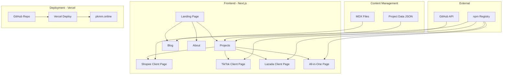
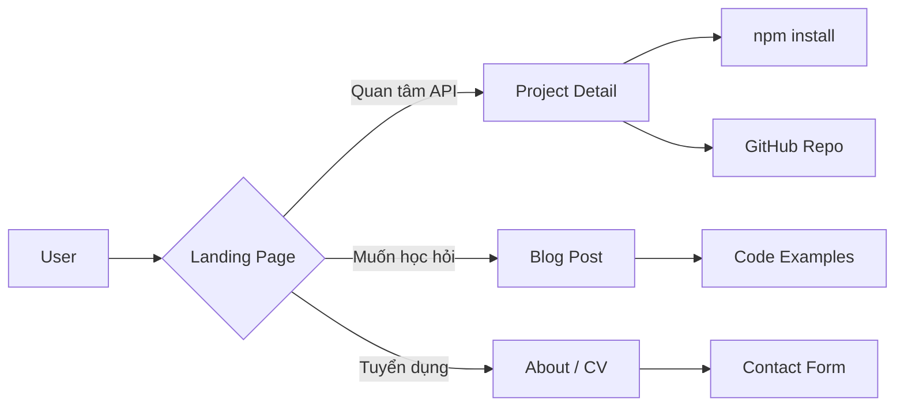

 Xây dựng Website pkmm.online

### 2.1 Tech Stack Đề xuất

| Thành phần | Công nghệ | Lý do |
|------------|-----------|-------|
| **Framework** | Next.js 14+ App Router | SSR, SEO tốt, React ecosystem |
| **Styling** | Tailwind CSS | Nhanh, responsive, phổ biến |
| **Content** | MDX / Contentlayer | Viết blog bằng markdown, type-safe |
| **Deployment** | Vercel | Free, tích hợp GitHub, auto-deploy |
| **Domain** | pkmm.online (đã có) | - |
| **Analytics** | Google Analytics / Plausible | Theo dõi traffic |
| **UI Components** | shadcn/ui hoặc Radix UI | Accessible, đẹp, dễ custom |

### 2.2 Cấu trúc Pages

```
pkmm.online/
├── /                          # Landing page
│   ├── Hero section
│   ├── Featured projects
│   ├── Tech stack
│   └── Contact CTA
│
├── /projects                  # Danh sách projects
│   ├── /shopee-api-client     # Chi tiết project
│   ├── /tiktok-api-client
│   ├── /lazada-api-client
│   └── /all-in-one-package
│
├── /blog                      # Technical blog
│   ├── /shopee-api-guide      # Hướng dẫn sử dụng
│   ├── /tiktok-api-guide
│   ├── /lazada-api-guide
│   └── /...other posts
│
├── /about                     # Giới thiệu bản thân
│   ├── CV / Experience
│   ├── Skills
│   └── Contact form
│
└── /api                       # API routes nếu cần
    └── /contact               # Form handler
```

### 2.3 Nội dung chi tiết từng Project Page

Mỗi project page cần có:

```markdown
## [Tên Package]

### Tổng quan
- Mô tả ngắn gọn
- Version hiện tại
- Số lượt tải npm

### Features
- Danh sách tính năng chính
- So sánh với các thư viện khác (nếu có)

### Quick Start
```bash
npm install [package-name]
```

### Code Example
```typescript
// Ví dụ code ngắn gọn, dễ hiểu
```

### API Documentation
- Link đến full docs
- Các method chính

### Related Projects
- Link đến các package liên quan
```

### 2.4 Nội dung Blog đề xuất

Các bài viết nên viết để tăng SEO và thể hiện chuyên môn:

1. **"Hướng dẫn tích hợp Shopee API với Node.js"** - Step-by-step guide
2. **"So sánh API các sàn thương mại điện tử: Shopee vs TikTok Shop vs Lazada"**
3. **"Xây dựng monorepo với npm workspaces và Changesets"**
4. **"Cách xử lý webhook push từ Shopee một cách an toàn"**
5. **"Từ ý tưởng đến npm package: Kinh nghiệm publish thư viện TypeScript"**

### 2.5 Sơ đồ Kiến trúc Website



### 2.6 Sơ đồ luồng người dùng



---

## Phần 3: Danh sách công việc chi tiết (Todo)

### Phase 1: GitHub Improvement (Ưu tiên cao - có thể làm ngay)

- [x] **1.1** Tạo GitHub Profile README repo `phamkhanhminhman97`
  - Đã tạo template tại [`plans/github-profile-readme.md`](./github-profile-readme.md). Cần copy sang repo đặc biệt `phamkhanhminhman97/phamkhanhminhman97`.
- [x] **1.2** Thêm badges vào README các package
- [x] **1.3** Thêm Issue/PR templates
- [x] **1.4** Cải thiện CI/CD
  - Đã thêm `npm test` step và release workflow theo tag `v*`.
  - Đã thêm `npm run coverage` bằng Node test runner, hiện cover unit tests cho Shopee Push/Webhook utilities.
- [x] **1.5** Thêm Code of Conduct & Contributing Guide

### Phase 2: Website Foundation

- [ ] **2.1** Khởi tạo Next.js project với Tailwind CSS
- [ ] **2.2** Cấu hình Vercel deployment + domain pkmm.online
- [ ] **2.3** Xây dựng layout cơ bản (Header, Footer, Navigation)
- [ ] **2.4** Tạo Landing Page với Hero section
- [ ] **2.5** Tạo trang Projects listing

### Phase 3: Project Pages

- [ ] **3.1** Trang Shopee API Client chi tiết
- [ ] **3.2** Trang TikTok Shop API Client chi tiết
- [ ] **3.3** Trang Lazada API Client chi tiết
- [ ] **3.4** Trang All-in-One Package chi tiết

### Phase 4: Blog & About

- [ ] **4.1** Tích hợp MDX/blog system
- [ ] **4.2** Viết 2-3 bài blog đầu tiên
- [ ] **4.3** Tạo trang About / CV
- [ ] **4.4** Thêm Contact form

### Phase 5: Polish & Launch

- [ ] **5.1** SEO optimization (meta tags, sitemap, OG images)
- [ ] **5.2** Responsive testing
- [ ] **5.3** Performance optimization
- [ ] **5.4** Analytics integration
- [ ] **5.5** Launch announcement trên GitHub & social

---

## Lợi ích mang lại

| Hạng mục | Lợi ích |
|----------|---------|
| **GitHub Profile README** | Ấn tượng với nhà tuyển dụng, đối tác |
| **Badges** | Tăng độ tin cậy, chuyên nghiệp |
| **Issue/PR Templates** | Tiết kiệm thời gian, chuẩn hóa quy trình |
| **pkmm.online** | Personal brand, SEO, portfolio |
| **Blog** | Thể hiện chuyên môn, thu hút traffic |
| **Project Pages** | Giúp người dùng hiểu và sử dụng thư viện dễ hơn |

---

## Ghi chú

- Website có thể deploy hoàn toàn miễn phí trên Vercel
- Domain pkmm.online cần trỏ DNS về Vercel
- Có thể dùng GitHub Actions để tự động sync npm stats lên website
- Blog content nên viết song ngữ Anh-Việt để tiếp cận nhiều đối tượng hơn
