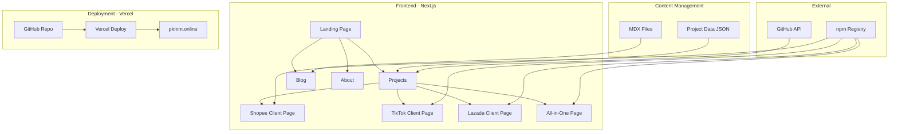
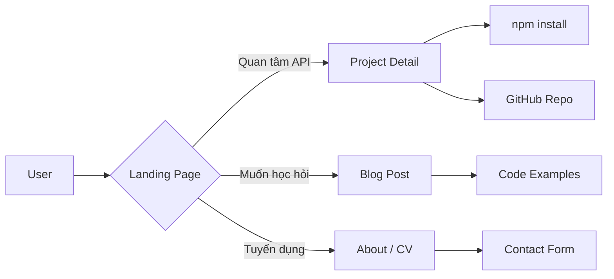

 Xây dựng Website pkmm.online

### 2.1 Tech Stack Đề xuất

| Thành phần | Công nghệ | Lý do |
|------------|-----------|-------|
| **Framework** | Next.js 14+ App Router | SSR, SEO tốt, React ecosystem |
| **Styling** | Tailwind CSS | Nhanh, responsive, phổ biến |
| **Content** | MDX / Contentlayer | Viết blog bằng markdown, type-safe |
| **Deployment** | Vercel | Free, tích hợp GitHub, auto-deploy |
| **Domain** | pkmm.online (đã có) | - |
| **Analytics** | Google Analytics / Plausible | Theo dõi traffic |
| **UI Components** | shadcn/ui hoặc Radix UI | Accessible, đẹp, dễ custom |

### 2.2 Cấu trúc Pages

```
pkmm.online/
├── /                          # Landing page
│   ├── Hero section
│   ├── Featured projects
│   ├── Tech stack
│   └── Contact CTA
│
├── /projects                  # Danh sách projects
│   ├── /shopee-api-client     # Chi tiết project
│   ├── /tiktok-api-client
│   ├── /lazada-api-client
│   └── /all-in-one-package
│
├── /blog                      # Technical blog
│   ├── /shopee-api-guide      # Hướng dẫn sử dụng
│   ├── /tiktok-api-guide
│   ├── /lazada-api-guide
│   └── /...other posts
│
├── /about                     # Giới thiệu bản thân
│   ├── CV / Experience
│   ├── Skills
│   └── Contact form
│
└── /api                       # API routes nếu cần
    └── /contact               # Form handler
```

### 2.3 Nội dung chi tiết từng Project Page

Mỗi project page cần có:

```markdown
## [Tên Package]

### Tổng quan
- Mô tả ngắn gọn
- Version hiện tại
- Số lượt tải npm

### Features
- Danh sách tính năng chính
- So sánh với các thư viện khác (nếu có)

### Quick Start
```bash
npm install [package-name]
```

### Code Example
```typescript
// Ví dụ code ngắn gọn, dễ hiểu
```

### API Documentation
- Link đến full docs
- Các method chính

### Related Projects
- Link đến các package liên quan
```

### 2.4 Nội dung Blog đề xuất

Các bài viết nên viết để tăng SEO và thể hiện chuyên môn:

1. **"Hướng dẫn tích hợp Shopee API với Node.js"** - Step-by-step guide
2. **"So sánh API các sàn thương mại điện tử: Shopee vs TikTok Shop vs Lazada"**
3. **"Xây dựng monorepo với npm workspaces và Changesets"**
4. **"Cách xử lý webhook push từ Shopee một cách an toàn"**
5. **"Từ ý tưởng đến npm package: Kinh nghiệm publish thư viện TypeScript"**

### 2.5 Sơ đồ Kiến trúc Website


```mermaid
graph TB
    subgraph "Frontend - Next.js"
        A[Landing Page] --> B[Projects]
        A --> C[Blog]
        A --> D[About]
        B --> E[Shopee Client Page]
        B --> F[TikTok Client Page]
        B --> G[Lazada Client Page]
        B --> H[All-in-One Page]
    end

    subgraph "Content Management"
        I[MDX Files] --> C
        J[Project Data JSON] --> B
    end

    subgraph "External"
        K[npm Registry] --> E
        K --> F
        K --> G
        K --> H
        L[GitHub API] --> B
    end

    subgraph "Deployment - Vercel"
        M[GitHub Repo] --> N[Vercel Deploy]
        N --> O[pkmm.online]
    end
```

### 2.6 Sơ đồ luồng người dùng


```mermaid
graph LR
    A[User] --> B{Landing Page}
    B -->|Quan tâm API| C[Project Detail]
    B -->|Muốn học hỏi| D[Blog Post]
    B -->|Tuyển dụng| E[About / CV]
    C --> F[npm install]
    C --> G[GitHub Repo]
    D --> H[Code Examples]
    E --> I[Contact Form]
```

---

## Phần 3: Trạng thái & việc còn lại

> **Cập nhật 2026-08-21.** Trước bản này, Phase 2-5 dưới đây đều đánh dấu `[ ]` chưa làm
> trong khi site đã chạy từ lâu — tài liệu tự khai sai còn tệ hơn không có tài liệu.
> Mục "còn lại" chỉ giữ việc **có số đo hoặc kiểm chứng được**; không có mục chung chung
> kiểu "cải thiện hiệu năng", vì mục như vậy không bao giờ được tick.

### ✅ Đã xong

**Phase 1 — GitHub**
- [x] Profile README · badges · Issue/PR templates · CI/CD + coverage · CoC & Contributing

**Phase 2-4 — Website**
- [x] Next.js + Tailwind, **triển khai trên Cloudflare** *(kế hoạch cũ ghi Vercel — đã đổi)*
- [x] Layout, landing page, trang danh sách projects
- [x] 4 trang chi tiết package (Shopee · TikTok Shop · Lazada · All-in-One)
- [x] Blog (3 bài) · trang About/CV · form liên hệ

**Phase 5 — Polish**
- [x] SEO: `metadataBase`, OpenGraph, Twitter card, canonical, sitemap phân mảnh
- [x] Ảnh OG 1200×630 theo file convention của Next
- [x] JSON-LD `Person` schema
- [x] Analytics (GA4, tôn trọng Do Not Track)

**Ngoài kế hoạch ban đầu**
- [x] **Song ngữ EN/VI** — `/` tiếng Anh mặc định, `/vi` tiếng Việt, hreflang + x-default
- [x] Mục **Research** và **Systems** ở trang About
- [x] Form liên hệ qua biến môi trường; thiếu khoá thì tự rơi về `mailto:`
- [x] **RSS feed** `/rss.xml` + autodiscovery trong `<head>`
- [x] Trang 404 song ngữ
- [x] **Tối ưu ảnh**: WebP + `<picture>`, resize theo kích thước hiển thị thật
      → payload trang chủ **2.581 KB → 1.013 KB (−61%)**
- [x] Skip-link, `width`/`height` chống layout shift, `loading="lazy"` cho logo

### Còn lại

- [ ] **Đổi domain sang `phamkhanhminhman.com`** — `.online` renew ~$50/năm;
      `.com` $10,46/năm cố định. Đã kiểm còn trống 2026-08-21.
      Cách chuyển: chạy song song → 301 từ `.online` → để hết hạn tự nhiên.
- [ ] **Blog đã 90 ngày không có bài mới** (mới nhất 23/05/2026). RSS giờ đã có,
      nhưng feed không có gì mới thì không ai theo dõi.
- [ ] Dark mode (`prefers-color-scheme`)
- [ ] Điền **số đo thật** vào Experience — hiện 0/20 gạch đầu dòng có số
      (thông lượng, số đơn/ngày, p95 trước-sau). Chỉ tác giả mới có số này.
- [ ] Ảnh OG riêng cho trang blog/project *(giờ mọi trang dùng chung một ảnh)*

### Không làm, và vì sao

- **Nén PNG dự phòng**: đã thử giảm bảng màu (256 màu vẫn đổi 16,6% pixel) và nén
  lossless (Pillow làm file *to hơn*). PNG chỉ là fallback cho trình duyệt không đọc
  được WebP — gần như không tồn tại năm 2026 — nên không đáng đánh đổi chất lượng.

## Lợi ích mang lại

| Hạng mục | Lợi ích |
|----------|---------|
| **GitHub Profile README** | Ấn tượng với nhà tuyển dụng, đối tác |
| **Badges** | Tăng độ tin cậy, chuyên nghiệp |
| **Issue/PR Templates** | Tiết kiệm thời gian, chuẩn hóa quy trình |
| **pkmm.online** | Personal brand, SEO, portfolio |
| **Blog** | Thể hiện chuyên môn, thu hút traffic |
| **Project Pages** | Giúp người dùng hiểu và sử dụng thư viện dễ hơn |

---

## Ghi chú

- Website có thể deploy hoàn toàn miễn phí trên Vercel
- Domain pkmm.online cần trỏ DNS về Vercel
- Có thể dùng GitHub Actions để tự động sync npm stats lên website
- Blog content nên viết song ngữ Anh-Việt để tiếp cận nhiều đối tượng hơn
